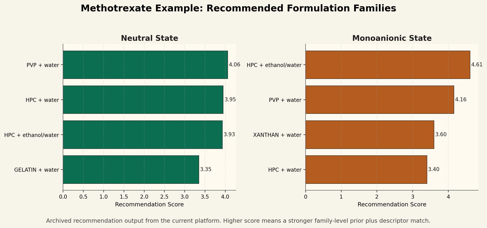
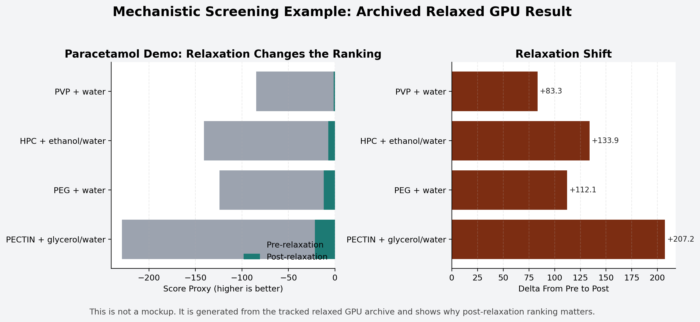

# Methotrexate Dosage

Give us an API, and this platform recommends the most promising formulation families to test first.

This repository provides a simple workflow for unseen-API formulation-family recommendation. Users provide an API structure, and the platform generates candidate systems, runs mechanistic screening when a checkpoint is available, and returns a shortlist for DFT and lab testing.

## What It Does

This repo is a lightweight platform for recommending and ranking candidate formulation families for a new API before lab evaluation.

It currently does four things well:

- takes an API structure as input
- extracts formulation-relevant API descriptors automatically
- generates candidate formulation systems from API classes and family priors
- ranks those systems and returns a shortlist for downstream DFT and wet-lab work

The user-facing outputs are:

- `summary.md`
- `ranking.csv`
- `candidate_matrix_generated.csv`
- `buy_list.txt`
- `lab_test_plan.txt`

## Example Evidence

These are generated from tracked repository outputs, not mockups.

Methotrexate family recommendation example:



What it shows:

- the platform does not return one vague answer
- it separates neutral and ionic recommendation branches
- it produces a ranked family shortlist that matches the current chemical interpretation of methotrexate

Archived mechanistic screening example:



What it shows:

- the mechanistic layer is doing nontrivial work after relaxation
- post-relaxation ranking differs from pre-relaxation ranking
- the archived GPU result is strong enough to justify using this repo as a shortlist-generation platform

## What It Does Not Do

This repo is not:

- a final formulation predictor
- a printability predictor
- a full formulation design platform

It does not directly predict:

- final formulation ratios
- exact printability windows
- exact dissolution curves
- long-term stability
- full bulk rheology

The correct framing is:

- preformulation triage platform
- formulation-family recommendation and screening layer
- shortlist generator for DFT and lab validation

## Quick Start

The simplest user entry point is the repo-root script:

```bash
python run_unseen_api_recommendation.py \
  --api-name methotrexate \
  --api-smiles "CN(Cc1cnc2c(n1)c(nc(n2)N)N)c3ccc(cc3)C(=O)N[C@@H](CCC(=O)O)C(=O)O" \
  --context semi_solid_printing
```

If `checkpoints/best_inference_ckpt.pt` is present, the platform will also launch the mechanistic screening layer on the generated candidate matrix. If no checkpoint is present, it still returns the recommendation-layer shortlist and planning files.

For a JSON-driven run:

```bash
python run_unseen_api_recommendation.py \
  --input-json data/preformulation/methotrexate_family_recommendation_input.json
```

## Repo Structure

The repo is structured in three layers.

### Layer 1: User-Facing Platform Layer

Users mainly interact with:

- [run_unseen_api_recommendation.py](run_unseen_api_recommendation.py)
- API input flags or a JSON input file
- final recommendation reports and shortlist files

### Layer 2: Candidate Generation Layer

Backend modules:

- [extract_api_descriptors.py](scripts/extract_api_descriptors.py)
- [classify_api.py](scripts/classify_api.py)
- [generate_candidate_matrix.py](scripts/generate_candidate_matrix.py)
- [explain_results.py](scripts/explain_results.py)

This layer handles:

- descriptor extraction
- API classification
- family priors
- candidate matrix generation
- user-facing explanation files

### Layer 3: Mechanistic Screening Layer

Backend screening scripts:

- [run_preformulation_mechanistic_screen.py](scripts/run_preformulation_mechanistic_screen.py)
- [run_formulation_descriptor_pilot.py](scripts/run_formulation_descriptor_pilot.py)
- [run_preformulation_mechanistic_screen_gpu_normal.lsf.sh](jobs/run_preformulation_mechanistic_screen_gpu_normal.lsf.sh)

This layer handles:

- local cluster building
- relaxation
- replicate scoring
- aggregated ranking

## Key Data Assets

Core libraries and priors:

- [family_recommendation_priors.csv](data/preformulation/family_recommendation_priors.csv)
- [polymer_descriptor_library.csv](data/preformulation/polymer_descriptor_library.csv)
- [methotrexate_family_recommendation_input.json](data/preformulation/methotrexate_family_recommendation_input.json)
- [SMILES_3D](SMILES_3D)
- [render_repo_figures.py](scripts/render_repo_figures.py)

Current docs:

- [unseen_api_recommendation_system_v1.md](docs/unseen_api_recommendation_system_v1.md)
- [project_status_summary.md](docs/project_status_summary.md)
- [dft_spotcheck_plan_v1.md](docs/dft_spotcheck_plan_v1.md)

## Current Repo Positioning

If someone asks what this repo is right now, the best answer is:

The current repo is a recommendation-and-screening platform for unseen APIs. It is designed to propose plausible formulation families, rank them mechanistically, and produce a shortlist for downstream DFT and lab evaluation.

## Current Archived Findings

The repo currently tracks two important archived outputs.

Paracetamol relaxed GPU demo:

- [mechanistic_screen_relaxed_gpu_v3](results/mechanistic_screen_relaxed_gpu_v3)
- top neutral demo candidate stayed `PVP + water`
- main lesson: relaxation matters and static rankings are not enough

Methotrexate family recommendation v1:

- [methotrexate_family_recommendation_v1](results/methotrexate_family_recommendation_v1)
- neutral shortlist: `PVP + water`, `HPC + water`, `HPC + ethanol/water`
- monoanionic shortlist: `HPC + ethanol/water`, `PVP + water`, `Xanthan + water`

## Current Output Logic

The main user-facing pipeline is:

`new API input -> automatic candidate generation -> mechanistic ranking when available -> DFT/lab shortlist output`

That is the main line of the repo. Everything else is support code behind that flow.

## Notes

- `checkpoints/` is intentionally empty in git.
- `results/unseen_api_recommendation_run/` and other default run directories are ignored by default.
- the repo is useful for shortlist generation, not final decision-making.
- if you used a temporary GitHub token to push, revoke and rotate it afterward.
